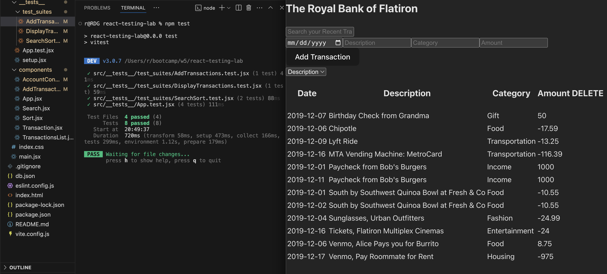

# React Testing Lab

## Description
this is a simple banking app that lets users track their expenses and incomes by adding transactions and searching through them. 
I added a full vitest testing suite to make sure everything works as expected.

## Table of contents
1. [Demo](#demo)  
2. [Setup](#setup)  
3. [Testing](#testing)  
4. [Features](#features)  
5. [Prerequisites](#prerequisites)  

## Demo

## Setup
1. Fork & clone the repo  
2. Run `npm install` to install dependencies  
3. Start backend: `npm run server`  
4. Start frontend: `npm run dev`  

## Testing
- Run `npm test` to run the tests

## Features
- Display transactions on startup  
- Add new transactions (with server POST)  
- Search transactions by description/category  
- Sort transactions by description or category  

## Prerequisites
- node.js v14+  
- npm v6+  